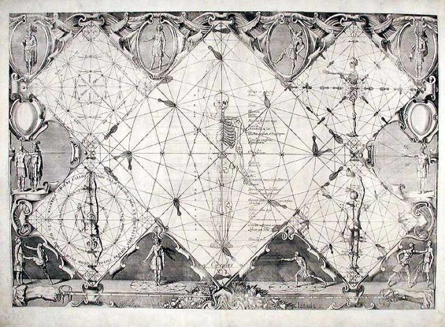

One of the things that drew me to Thibault's system was how each action is derived through it's geometric relationships to each component of the fencer and the duel. There is nothing that Thibault says that is not backed up but a relationship, which he carefully builds by observable relationship from the diameter, or the total length of a person from the soles of their feet to the height of the arm outstretched with elbow next to the top of the head. This leads to a system of fighting where each distance is relative only to one variable, the height of the fencer.

*Image Public Domain. Source [Wikimedia](https://commons.wikimedia.org/wiki/File:Gerard_Thibault_Mysterious_Circle.jpg)*

As I dug into the _Academy of the Sword_ I couldn't help myself from having my mind wander to how these relationships plotted into formula's. Since height is the basis of the circle and each intersection is one step, then a formula for the stride of someone at a given height should be attainable. Thankfully Doroga of [Black Birds and Blades](https://blackbirdsandblades.blogspot.com/) pointed me to an amazing article in the [Acta Periodica Duellatorum](https://www.actaperiodicaduellatorum.com/).

> Quoted Text
